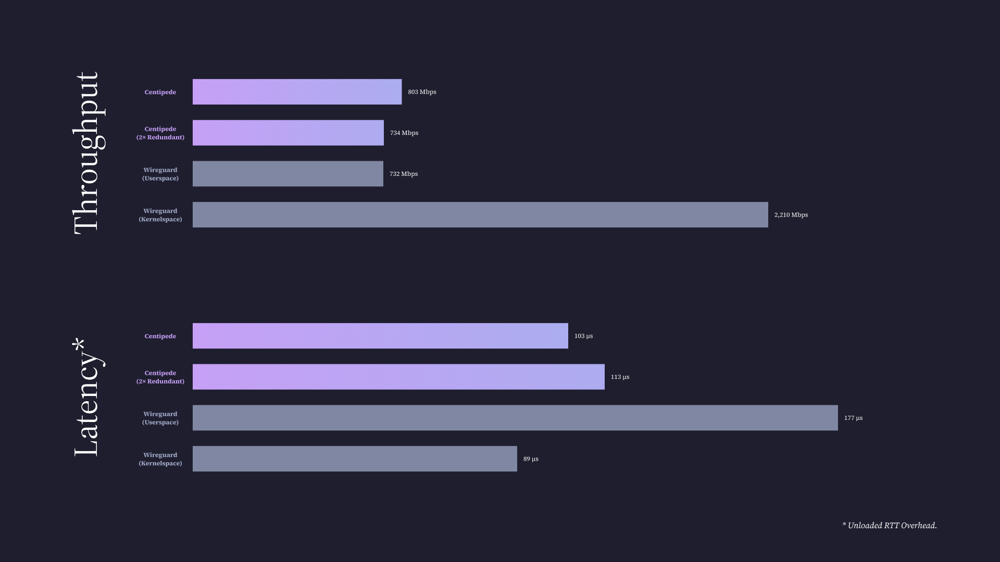

# Centipede

    
    
    
    
    

Centipede is a work-in-progress multipathing VPN for improving connection reliability and performance for mobile devices and site-to-site connections.

Like WireGuard, Centipede aims to provide a stateless user interface for establishing VPN connections.
Peers establish connections via public key, and each side can freely roam between arbitrary sets of addresses, even behind NAT.
This enables a few use cases, including

1. Reliably connecting mobile devices which roam between cellular networks and Wi-Fi networks.
2. Balancing VPN connection load between multiple physical machines, without the client's knowledge.
3. Live migration of VPN connections between physical machines, without the other peer's knowledge.

## Support and Development

If you're interested in helping out with Centipede, need help using, or just want to hang out, [join the development Discord server](https://discord.gg/3wJyrBsKXu).

## Protocol and Implementation Overview

Centipede, like WireGuard, encapsulates IP packets in UDP datagrams encrypted with ChaCha20Poly1305 along with a small (32-byte) header.
Each packet is sent arbitrarily many times, and the receiving peer deduplicates them on the other end.

Centipede connections are initiated by a two-way handshake authenticated using Ed25519 signatures.
After the handshake, peers send "heartbeat" messages to inform the other peer of addresses where they're reachable.
Because the address is taken from the IP header of the mesage,
Centipede connections can traverse NAT on one side of the connection,
or even both with out-of-band NAT traversal for the initial handshake.

Handshake initiations also include a timestamp which is used to

1. Uniquely identify the handshake, allowing acknowledgements to be matched to initiations.
2. Prevent replay attacks.
3. Break ties between simultaneous initiations by both peers.

## Performance

Centipede's current implementation is highly performant for a userspace VPN.
It uses a thread-per-core architecture, with all shared state implemented in a lock-free manner.
In addition to userspace state, Centipede creates TUN queues and sets of UDP sockets for each worker, eliminating the need for expensive cross-thread synchronization on the kernel's part.

Below are some benchmark results of Centipede against WireGuard's user- and kernel-space implementations.

## Todo

- [ ] Dynamic reconfigurability via an HTTP API and CLI wrapper over it.
- [ ] Routing based on destination VPN address.
- [ ] Path MTU discovery.
- [ ] Bandwidth aggregation.
- [ ] Traffic shaping.
- [ ] Split into distinct transport and tunnel layers?
- [ ] Android app.
